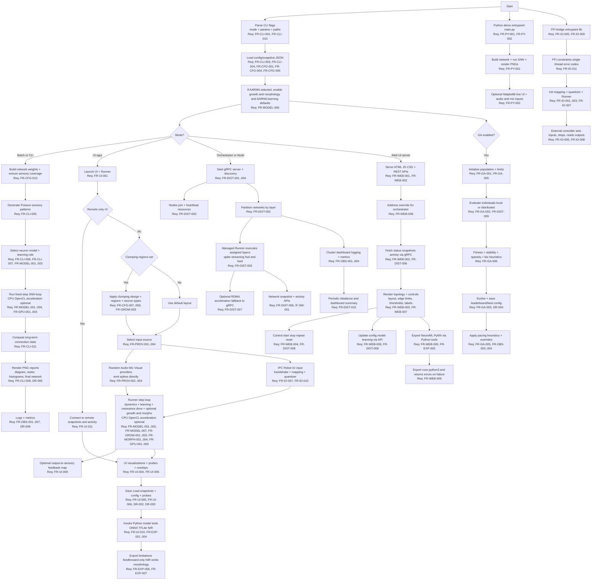

# Software Requirements Specification (SRS)
AARNN

Version: 0.1
Status: Draft
Date: 2026-01-18 (README last updated)

## 1. Introduction

### 1.1 Purpose
This document defines requirements reverse engineered from the current source code
and in-repo documentation. It is intended to align implementation behavior with
explicit, testable requirements.

### 1.2 Scope
The system is a neuromorphic spiking neural network simulator with:
- A Rust core engine for batch and real-time simulation.
- An interactive UI (egui/eframe) for live control and visualization.
- Optional distributed execution with gRPC and RDMA.
- A web UI server and browser frontend for remote monitoring and control.
- Python tools for model import/export and auxiliary workflows.
- Robot IO, IPC, and FFI integration for simulators such as Webots.

### 1.3 Definitions, Acronyms, Abbreviations
- AARNN: Auto-Asynchronous Recursive Neuromorphic Network.
- CLI: Command-line interface.
- GA: Genetic algorithm.
- gRPC: Remote procedure calls used for distributed cluster control.
- IPC: Inter-process communication.
- LIF: Leaky Integrate-and-Fire neuron model.
- NIR: Neuromorphic Intermediate Representation (JSON).
- RDMA: Remote Direct Memory Access.
- SNN: Spiking neural network.
- STDP: Spike-Timing-Dependent Plasticity.
- UDS: Unix domain sockets.

### 1.4 References
- `README.md`
- `DOCKER_OPENSHIFT.md`
- `src/main.rs`, `src/sim.rs`, `src/network.rs`, `src/runner.rs`, `src/ui.rs`
- `src/distributed.rs`, `proto/distributed.proto`
- `src/bin/web_ui.rs`, `web_ui/index.html`, `web_ui/app.js`, `web_ui/style.css`
- `src/bridge.rs`, `src/ffi.rs`, `include/neuromorphic_bridge.h`
- `tools/*.py`

### 1.5 Document Conventions
- Requirement statements use "shall".
- Conditional requirements specify build features or runtime flags.
- Requirement IDs are unique and stable.

## 2. Overall Description

### 2.1 Product Perspective
The system is a modular simulator. The Rust library exposes core SNN primitives,
while binaries provide CLI execution (`aarnn_rust`) and web UI (`web_ui`).
Optional feature flags enable UI, growth/morphology, OpenCL, and robotics bridges.
Distributed operation is implemented over gRPC, with optional RDMA acceleration.

### 2.2 Product Functions (Summary)
- Build and simulate spiking networks in batch or real time.
- Visualize activity, weights, and topology in a UI or PNG reports.
- Support AARNN growth and morphology-based conduction delays.
- Support AARNN resonance-driven pseudo-spontaneous stimulation for reverberant loops.
- Import/export models and snapshots via JSON, ONNX, TFLite, NIR, NeuroML, PyNN.
- Scale a single network across a cluster with orchestrator/node roles.
- Interface with robots/simulators via IPC or FFI.

### 2.3 User Classes and Characteristics
- Researcher: explores neuromorphic dynamics and learning rules.
- Developer: integrates external IO, adds features, or extends formats.
- Operator: runs clusters and monitors performance.
- Robotics Integrator: connects SNN outputs to simulated or physical devices.

### 2.4 Operating Environment
- Rust 2021 toolchain and Cargo.
- Python 3 with `requirements.txt` for model tools and legacy UI.
- Optional dependencies for UI (eframe/egui), audio (cpal/symphonia),
  OpenCL, OpenCV, and webcam input.
- Linux/macOS/Windows for core Rust; some IPC features require Unix.

### 2.5 Constraints
- Feature-gated functionality depends on compile-time flags.
- Batch AARNN uses Izh dynamics; full AARNN behavior is in Runner/UI.
- gRPC endpoints are unauthenticated; intended for trusted networks.
- GPU acceleration depends on OpenCL drivers.

### 2.6 Assumptions and Dependencies
- File system is writable for logs, PNG outputs, and JSON snapshots.
- Audio input requires OS permissions and device availability.
- Distributed nodes can reach orchestrator over the network.

### 2.7 Out of Scope
- Long-term dataset training pipelines.
- Persistent user accounts or authentication services.
- Formal safety certification.

### 2.8 Workflow Overview (Mermaid)

## 3. System Features and Functional Requirements

### 3.1 Core Simulation and CLI (Batch)
| ID | Requirement | Source |
| --- | --- | --- |
| FR-CLI-001 | The system shall provide a CLI to run batch simulations and select modes (batch, UI, orchestrator, node). | `src/main.rs` |
| FR-CLI-002 | The CLI shall accept parameters for simulation time, dt, seed, neuron model, learning rule, and layer sizes. | `src/main.rs` |
| FR-CLI-003 | The system shall load configuration from a JSON file if it exists, otherwise derive defaults from CLI flags. | `src/main.rs` |
| FR-CLI-004 | The system shall allow a network snapshot JSON to override configuration and weights at startup. | `src/main.rs`, `src/runner.rs` |
| FR-CLI-005 | The batch simulator shall generate Poisson sensory input patterns when no external inputs are provided. | `src/sim.rs` |
| FR-CLI-006 | The batch simulator shall support LIF, Izhikevich, and AARNN neuron model selections. | `src/sim.rs`, `src/main.rs` |
| FR-CLI-007 | The batch simulator shall apply STDP, Hebbian, Oja, or AARNN learning rules, with AARNN mapped to STDP in batch mode. | `src/sim.rs` |
| FR-CLI-008 | The system shall generate PNG reports: network diagram, spike raster, weight histograms, and final weighted network. | `src/main.rs`, `src/viz.rs`, `main.py` |
| FR-CLI-009 | In continuous mode, the system shall run indefinitely and auto-adjust dt based on compute cost and safety heuristics. | `src/main.rs`, `src/monitor.rs` |
| FR-CLI-010 | The CLI shall accept flags for config/snapshot paths, logging (trace/quiet), IPC/UI remote-only, growth toggles, GA search, and distributed parameters (orchestrator/node, addresses, brain ID). | `src/main.rs` |
| FR-CLI-011 | Batch simulation shall compute and report long-term connection counts and totals. | `src/sim.rs`, `src/main.rs` |

### 3.2 Configuration and Persistence
| ID | Requirement | Source |
| --- | --- | --- |
| FR-CFG-001 | The system shall define a NetworkConfig with parameters for topology, growth, morphology, and learning. | `src/config.rs` |
| FR-CFG-002 | The system shall export the current NetworkConfig as JSON. | `src/runner.rs` |
| FR-CFG-003 | The system shall import a NetworkConfig from JSON and reset internal state safely. | `src/runner.rs` |
| FR-CFG-004 | The system shall export a network snapshot JSON including weights and optional topology/morphology. | `src/runner.rs` |
| FR-CFG-005 | The system shall import a network snapshot JSON and resize internal state to match matrix shapes. | `src/runner.rs` |
| FR-CFG-006 | The system shall support explicit sensory target and output source layer mapping in configuration. | `src/config.rs`, `tests/reproduce_issue.rs` |
| FR-CFG-007 | The configuration shall support brain region definitions with shapes and neuron type distributions. | `src/config.rs` |
| FR-CFG-008 | The configuration shall support neuron type definitions with AARNN bio parameters. | `src/config.rs`, `src/runner.rs` |
| FR-CFG-009 | The system shall apply clumping design presets to populate brain regions and update the selected design. | `src/config.rs`, `src/runner.rs`, `src/ui.rs` |
| FR-CFG-010 | Network initialization shall ensure each sensory input connects to at least one first hidden neuron. | `src/network.rs` |
| FR-CFG-011 | The configuration shall include AARNN resonance gain to scale pseudo-spontaneous reverberation. | `src/config.rs` |

### 3.3 Interactive Runner and UI
| ID | Requirement | Source |
| --- | --- | --- |
| FR-UI-001 | When built with `ui`, the system shall provide a real-time GUI for visualization and control. | `src/ui.rs` |
| FR-UI-002 | The UI shall support start, stop, repeat, and reset of the simulation. | `src/ui.rs` |
| FR-UI-003 | The UI shall allow runtime selection of neuron model and learning rule. | `src/ui.rs` |
| FR-UI-004 | The UI shall visualize network topology and activity with overlays and highlights. | `src/ui.rs` |
| FR-UI-005 | The UI shall provide an oscilloscope and probe system, including save/load of probe metadata as JSON. | `src/ui.rs` |
| FR-UI-006 | The UI shall allow loading and saving network snapshots and configuration from disk. | `src/ui.rs`, `src/runner.rs` |
| FR-UI-007 | The UI shall support remote-only mode that connects to distributed orchestrators/nodes. | `src/ui.rs`, `src/distributed.rs` |
| FR-UI-008 | The UI shall expose GA search controls and display GA progress when enabled. | `src/ui.rs`, `src/ga.rs` |
| FR-UI-009 | The UI shall allow enabling output-to-sensory feedback loops using a configurable map. | `src/ui.rs`, `src/runner.rs` |
| FR-UI-010 | The UI shall invoke Python-based import/export tools for ONNX, TFLite, and NIR. | `src/ui.rs`, `tools/*.py` |
| FR-UI-011 | Remote-only UI mode shall avoid local simulation compute and use remote snapshots and activity. | `src/ui.rs`, `src/main.rs`, `README.md` |
| FR-UI-012 | The UI shall expose AARNN resonance gain control. | `src/ui.rs` |

### 3.4 Sensory Input Providers
| ID | Requirement | Source |
| --- | --- | --- |
| FR-PROV-001 | The system shall provide a random sensory provider that emits Bernoulli spikes. | `src/providers.rs` |
| FR-PROV-002 | The system shall provide an audio file provider that maps FFT bands to spikes. | `src/providers.rs` |
| FR-PROV-003 | The system shall provide a microphone provider for live audio input (when dependencies are available). | `src/providers.rs` |
| FR-PROV-004 | With `image_input`, `video_input`, or `webcam_input`, the system shall provide corresponding visual providers. | `src/providers.rs` |
| FR-PROV-005 | Providers shall allow dynamic resizing to match the sensory neuron count. | `src/providers.rs` |

### 3.5 Growth3D and Morphology (AARNN)
| ID | Requirement | Source |
| --- | --- | --- |
| FR-GROW-001 | With `growth3d`, the system shall maintain 3D topology for sensory, hidden, and output layers. | `src/topology.rs`, `src/runner.rs` |
| FR-GROW-002 | Growth shall support neuron spawning, layer splitting, and cooldowns based on configurable thresholds. | `src/runner.rs`, `src/config.rs` |
| FR-GROW-003 | The system shall assign region and neuron type labels based on brain region geometry and type distributions (ellipsoid, torus, tube, repeated ellipsoids). | `src/runner.rs`, `src/config.rs` |
| FR-MORPH-001 | With `morpho+growth3d`, the system shall model axons, dendrites, and synapse formation in 3D. | `src/morphology.rs` |
| FR-MORPH-002 | The system shall compute conduction delays from segment lengths and velocities when enabled. | `src/morphology.rs`, `src/runner.rs` |
| FR-MORPH-003 | The system shall prune or decay inactive components based on configured thresholds. | `src/morphology.rs`, `src/config.rs` |
| FR-MORPH-004 | The system shall store spike history buffers sized to the maximum delay. | `src/runner.rs` |

### 3.6 Neuron Models and Learning
| ID | Requirement | Source |
| --- | --- | --- |
| FR-MODEL-001 | The system shall implement LIF and Izhikevich neuron dynamics with standard presets. | `src/config.rs`, `src/sim.rs`, `src/runner.rs` |
| FR-MODEL-002 | The system shall implement AARNN dynamics when configured (Runner path). | `src/runner.rs`, `src/morphology.rs` |
| FR-MODEL-003 | The system shall implement STDP, Hebbian, Oja, and AARNN learning rules. | `src/sim.rs`, `src/runner.rs` |
| FR-MODEL-004 | AARNN bio parameters shall support STP, synaptic filtering, adaptive thresholds, and homeostasis. | `src/config.rs`, `src/runner.rs` |
| FR-MODEL-005 | Neuromodulation parameters shall be configurable and applied when enabled. | `src/config.rs`, `src/runner.rs` |
| FR-MODEL-006 | Selecting the AARNN model shall enable growth/morphology and use AARNN learning defaults where applicable. | `src/main.rs`, `src/ui.rs` |
| FR-MODEL-007 | When AARNN is active, the system shall provide resonance-driven pseudo-spontaneous spiking based on recent activity and modulated by ambient energy and skull energy when morphology is enabled. | `src/runner.rs` |

### 3.7 Distributed Simulation and Cluster
| ID | Requirement | Source |
| --- | --- | --- |
| FR-DIST-001 | The system shall provide gRPC APIs as defined in the distributed proto. | `proto/distributed.proto` |
| FR-DIST-002 | The orchestrator shall manage node discovery, network registry, and partitioning. | `src/distributed.rs` |
| FR-DIST-003 | Nodes shall send periodic heartbeats with resource and network metrics. | `src/distributed.rs` |
| FR-DIST-004 | Nodes shall support UDP-based orchestrator discovery when no address is provided. | `src/distributed.rs` |
| FR-DIST-005 | Nodes shall stream spike events to synchronize boundary layers. | `src/distributed.rs` |
| FR-DIST-006 | The system shall support fetching network snapshots and activity over gRPC. | `src/distributed.rs`, `proto/distributed.proto` |
| FR-DIST-007 | The system shall support RDMA acceleration when available, falling back to gRPC. | `src/rdma.rs` |
| FR-DIST-008 | The gRPC API shall support control, config, growth, and weight update messages for managed networks. | `proto/distributed.proto`, `src/distributed.rs` |
| FR-DIST-009 | The gRPC API shall support remote GA evaluation requests. | `proto/distributed.proto`, `src/distributed.rs`, `src/ga.rs` |
| FR-DIST-010 | The orchestrator shall periodically rebalance networks and emit a dashboard summary. | `src/main.rs`, `src/distributed.rs` |

### 3.8 Web UI Server and Frontend
| ID | Requirement | Source |
| --- | --- | --- |
| FR-WEB-001 | The system shall provide a web UI server that serves HTML, JS, and CSS assets. | `src/bin/web_ui.rs`, `web_ui/index.html` |
| FR-WEB-002 | The web UI server shall provide APIs for status, snapshot, activity, update, and control. | `src/bin/web_ui.rs` |
| FR-WEB-003 | The web UI shall visualize networks and display cluster status. | `web_ui/app.js`, `web_ui/index.html` |
| FR-WEB-004 | The web UI shall allow start/stop/repeat/reset control of networks. | `web_ui/app.js`, `src/bin/web_ui.rs` |
| FR-WEB-005 | The web UI shall allow export to NeuroML or PyNN via Python tools. | `src/bin/web_ui.rs`, `tools/export_neuroml.py`, `tools/export_pynn.py` |
| FR-WEB-006 | The web UI shall support updating network configuration, neuron model, and learning rule via API. | `src/bin/web_ui.rs`, `web_ui/app.js` |
| FR-WEB-007 | The web UI shall support rendering controls for layout choice, edge limits, weight thresholds, and region labels. | `web_ui/index.html`, `web_ui/app.js` |
| FR-WEB-008 | The web UI APIs shall accept an address override for the orchestrator. | `src/bin/web_ui.rs`, `web_ui/app.js` |
| FR-WEB-009 | The web UI export endpoint shall run Python tools via python3 and return errors on failures. | `src/bin/web_ui.rs` |

### 3.9 Model Export/Import Tools
| ID | Requirement | Source |
| --- | --- | --- |
| FR-EXP-001 | The system shall export ONNX models from network snapshots as linear MLPs. | `tools/export_onnx.py` |
| FR-EXP-002 | The system shall import ONNX models into network snapshots with fallbacks for naming conventions. | `tools/import_onnx.py` |
| FR-EXP-003 | The system shall export and import TFLite models from network snapshots. | `tools/export_tflite.py`, `tools/import_tflite.py` |
| FR-EXP-004 | The system shall export and import NIR JSON from network snapshots. | `tools/export_nir.py`, `tools/import_nir.py` |
| FR-EXP-005 | The system shall export NeuroML and PyNN from network snapshots. | `tools/export_neuroml.py`, `tools/export_pynn.py` |
| FR-EXP-006 | ONNX and TFLite export shall represent a feedforward snapshot with zero biases; imports shall reconstruct forward weights and use placeholders for backward, delays, and morphology. | `README.md`, `tools/export_onnx.py`, `tools/import_onnx.py`, `tools/export_tflite.py`, `tools/import_tflite.py` |
| FR-EXP-007 | NIR export shall include weights and optional topology but omit detailed morphology; attenuation flags are retained for interchange even if not applied in Rust. | `README.md`, `tools/export_nir.py`, `tools/import_nir.py` |

### 3.10 Robot IO, IPC, and FFI
| ID | Requirement | Source |
| --- | --- | --- |
| FR-IO-001 | The system shall support named IO port mappings for sensors and actuators. | `src/bridge.rs` |
| FR-IO-002 | The system shall provide a quantizer to convert floats to spikes and spikes to floats. | `src/bridge.rs` |
| FR-IO-003 | The system shall provide an in-memory adapter and external runner bridge for integration. | `src/bridge.rs` |
| FR-IO-004 | With `robot_io` on Unix, the UI shall support UDS-based IPC for external controllers. | `src/ui.rs` |
| FR-IO-005 | With `ffi_bridge`, the system shall provide a C ABI for in-process control. | `src/ffi.rs`, `include/neuromorphic_bridge.h` |
| FR-IO-006 | Example Webots controllers and device mapping utilities shall be included. | `examples/*.cpp`, `include/device_mapper.hpp` |
| FR-IO-007 | The robot IO bridge shall support time synchronization, per-port normalization, and population encoding. | `src/bridge.rs` |
| FR-IO-008 | The FFI bridge shall allow updating the quantizer threshold at runtime. | `src/ffi.rs`, `include/neuromorphic_bridge.h` |
| FR-IO-009 | The FFI bridge shall accept JSON configuration for sensory/output sizes with optional threshold and port names. | `src/ffi.rs`, `include/neuromorphic_bridge.h` |
| FR-IO-010 | The UI IPC mode shall accept handshake metadata to label ports and rebuild the IO mapping. | `src/ui.rs`, `src/bridge.rs` |
| FR-IO-011 | The FFI API shall be non-reentrant, single-threaded, and return negative codes for invalid usage; shutdown is a no-op. | `include/neuromorphic_bridge.h`, `src/ffi.rs` |

### 3.11 GPU Acceleration
| ID | Requirement | Source |
| --- | --- | --- |
| FR-GPU-001 | With `opencl`, the system shall support GPU acceleration for compute-heavy steps. | `src/cl_compute.rs`, `src/sim.rs`, `src/runner.rs` |
| FR-GPU-002 | GPU device selection shall be configurable via environment variables. | `README.md`, `src/cl_compute.rs`, `src/ga.rs` |
| FR-GPU-003 | OpenCL STP acceleration shall be enabled only when `NM_OPENCL_STP` is set. | `src/runner.rs` |

### 3.12 Genetic Algorithm Search
| ID | Requirement | Source |
| --- | --- | --- |
| FR-GA-001 | The system shall provide a GA search to optimize network parameters. | `src/ga.rs` |
| FR-GA-002 | GA search shall support local parallelism and distributed evaluation. | `src/ga.rs`, `src/distributed.rs` |
| FR-GA-003 | GA search shall persist results to `leaderboard.json` and `best_config_ga.json`. | `src/main.rs`, `src/ga.rs` |
| FR-GA-004 | A Python GA search script shall be provided for offline optimization. | `tools/genetic_param_search.py` |
| FR-GA-005 | GA execution shall apply thermal/CPU/memory pacing heuristics, pausing on hot thermal conditions until cooled, and allow environment-based overrides. | `src/ga.rs`, `ga_safety_heuristics.json` |
| FR-GA-006 | GA fitness shall consider long-term connection stability, layer count, sparsity, and bio parameter heuristics. | `src/ga.rs` |
| FR-GA-007 | GA search shall include tunables for AARNN resonance, I/O layer overrides, neuron caps, and Izh presets. | `src/ga.rs` |

### 3.13 Observability and Monitoring
| ID | Requirement | Source |
| --- | --- | --- |
| FR-OBS-001 | The system shall provide a metrics registry and periodic reporting. | `src/obs.rs` |
| FR-OBS-002 | The system shall support log file output with rotation and silence mode. | `src/obs.rs`, `src/main.rs` |
| FR-OBS-003 | The system shall provide safety snapshots for CPU, memory, temperature, and GPU. | `src/monitor.rs` |
| FR-OBS-004 | Continuous and GA modes shall use safety heuristics to throttle or pause. | `src/main.rs`, `src/ga.rs`, `src/monitor.rs` |
| FR-OBS-005 | Logging shall use `NM_LOG_PATH` when set, otherwise default to `logs/nm-<timestamp>.log`. | `src/main.rs` |
| FR-OBS-006 | Log rotation thresholds shall be configurable via environment variables. | `src/obs.rs` |
| FR-OBS-007 | Trace logging shall be enabled when `NM_TRACE=1` or `--trace` is used. | `src/main.rs`, `src/runner.rs`, `src/network.rs` |

### 3.14 Shared Memory IPC (Experimental)
| ID | Requirement | Source |
| --- | --- | --- |
| FR-SHM-001 | With `shmem`, the system shall provide a shared memory ring buffer API skeleton. | `src/shmem.rs` |
| FR-SHM-002 | Shared memory read/write operations shall return WouldBlock when unimplemented. | `src/shmem.rs` |

### 3.15 Python Demo and Legacy Tools
| ID | Requirement | Source |
| --- | --- | --- |
| FR-PY-001 | The Python demo shall generate the same PNG reports as the Rust batch path. | `main.py` |
| FR-PY-002 | The Python demo shall provide a live Matplotlib UI with audio/microphone inputs when requested. | `main.py` |

### 3.16 Deployment and Containerization
| ID | Requirement | Source |
| --- | --- | --- |
| FR-DEP-001 | The repository shall include a multi-arch container build for CLI and web UI binaries. | `Containerfile`, `build_container.sh` |
| FR-DEP-002 | The repository shall include OpenShift/Kustomize deployment manifests. | `deploy/` |
| FR-DEP-003 | The container shall support CLI, UI, orchestrator, node, and web UI modes. | `DOCKER_OPENSHIFT.md` |

## 4. External Interface Requirements

### 4.1 User Interfaces
| ID | Requirement | Source |
| --- | --- | --- |
| IF-UI-001 | The CLI shall expose flags for simulation and mode selection. | `src/main.rs` |
| IF-UI-002 | The native UI shall expose controls for models, learning rules, inputs, growth, and probes. | `src/ui.rs` |
| IF-UI-003 | The web UI shall provide controls for network selection, rendering, and start/stop/reset. | `web_ui/index.html`, `web_ui/app.js` |

### 4.2 Software Interfaces
| ID | Requirement | Source |
| --- | --- | --- |
| IF-SW-001 | The gRPC API shall follow `proto/distributed.proto`. | `proto/distributed.proto` |
| IF-SW-002 | Network snapshot JSON shall follow the Runner snapshot schema (weights + config). | `src/runner.rs` |
| IF-SW-003 | The C ABI shall follow `include/neuromorphic_bridge.h`. | `src/ffi.rs`, `include/neuromorphic_bridge.h` |
| IF-SW-004 | ONNX, TFLite, NIR, NeuroML, and PyNN tools shall accept file paths as CLI args. | `tools/*.py` |

### 4.3 Hardware Interfaces
| ID | Requirement | Source |
| --- | --- | --- |
| IF-HW-001 | Audio input shall use system microphone or audio files when available. | `src/providers.rs`, `main.py` |
| IF-HW-002 | GPU acceleration shall use OpenCL-capable devices when enabled. | `src/cl_compute.rs` |
| IF-HW-003 | RDMA shall use InfiniBand/RoCE when built and available. | `src/rdma.rs` |

### 4.4 Communications
| ID | Requirement | Source |
| --- | --- | --- |
| IF-COM-001 | The orchestrator shall listen on gRPC (default 0.0.0.0:50051). | `src/main.rs`, `src/distributed.rs` |
| IF-COM-002 | Orchestrator discovery shall use UDP port 50050. | `src/distributed.rs`, `README.md` |
| IF-COM-003 | The web UI server shall listen on HTTP port 8080 by default. | `src/bin/web_ui.rs` |

## 5. Data Requirements

### 5.1 Data Formats
| ID | Requirement | Source |
| --- | --- | --- |
| DR-001 | Config files shall be JSON matching NetworkConfig fields. | `src/config.rs`, `config.json` |
| DR-002 | Network snapshots shall be JSON with matrices (rows, cols, data). | `src/runner.rs`, `network.json` |
| DR-003 | Probe metadata shall be JSON arrays with id/name/color/target/type. | `src/ui.rs`, `README.md` |
| DR-004 | GA results shall be stored in JSON files (`leaderboard.json`, `best_config_ga.json`). | `src/main.rs`, `src/ga.rs` |
| DR-005 | Batch visualization outputs shall be PNG files with fixed names. | `src/main.rs`, `src/viz.rs` |
| DR-006 | Network snapshots may include connection presence matrices and optional layer ranges for distributed partitions. | `src/runner.rs` |
| DR-007 | GA safety heuristics and (optional) core affinity history shall be stored in JSON files. | `src/ga.rs`, `ga_safety_heuristics.json`, `ga_core_affinity.json` |

### 5.2 Data Persistence and Retention
| ID | Requirement | Source |
| --- | --- | --- |
| DR-008 | Logs shall be written to `logs/` by default and rotated by size limits. | `src/obs.rs`, `src/main.rs` |
| DR-009 | Temporary files used by web exports shall be written to OS temp directories. | `src/bin/web_ui.rs` |

## 6. Nonfunctional Requirements

### 6.1 Performance
| ID | Requirement | Source |
| --- | --- | --- |
| NFR-PERF-001 | Continuous mode shall target real-time stepping with adaptive dt. | `src/main.rs` |
| NFR-PERF-002 | GPU acceleration shall be optional and disabled when unavailable. | `src/cl_compute.rs`, `src/rdma.rs` |

### 6.2 Reliability and Availability
| ID | Requirement | Source |
| --- | --- | --- |
| NFR-REL-001 | RDMA shall fall back to gRPC when hardware is missing. | `src/rdma.rs` |
| NFR-REL-002 | The system shall tolerate missing optional providers by disabling them. | `src/providers.rs`, `README.md` |

### 6.3 Usability
| ID | Requirement | Source |
| --- | --- | --- |
| NFR-USE-001 | The UI shall provide status and error feedback for loading/saving actions. | `src/ui.rs` |

### 6.4 Maintainability
| ID | Requirement | Source |
| --- | --- | --- |
| NFR-MAINT-001 | Features shall be isolated via Cargo feature flags. | `Cargo.toml` |

### 6.5 Portability
| ID | Requirement | Source |
| --- | --- | --- |
| NFR-PORT-001 | Core build shall target Rust 2021 and run on standard desktop OSes. | `Cargo.toml` |

### 6.6 Security
| ID | Requirement | Source |
| --- | --- | --- |
| NFR-SEC-001 | gRPC and web UI endpoints are unauthenticated and intended for trusted networks only. | `proto/distributed.proto`, `src/bin/web_ui.rs` |

## 7. Verification and Validation

### 7.1 Automated Tests
- Unit tests in `src/network.rs` and `src/config.rs` verify shapes and defaults.
- Integration tests in `tests/reproduce_issue.rs` cover growth and AARNN import paths.

### 7.2 Manual Validation (Representative)
- Batch PNG outputs: run `cargo run --quiet` and verify files exist.
- UI startup: run `cargo run --features ui -- --ui`.
- Distributed mode: start orchestrator and node with gRPC addresses.
- Web UI: run `cargo run --bin web_ui -- --listen 0.0.0.0:8080`.

## 8. Traceability Summary
- CLI/batch simulation: `src/main.rs`, `src/sim.rs`, `src/network.rs`, `src/viz.rs`.
- UI/Runner: `src/ui.rs`, `src/runner.rs`, `src/providers.rs`.
- Distributed: `src/distributed.rs`, `proto/distributed.proto`.
- Export/import tools: `tools/*.py`.
- Robotics/FFI: `src/bridge.rs`, `src/ffi.rs`, `include/*.h`, `examples/*.cpp`.
