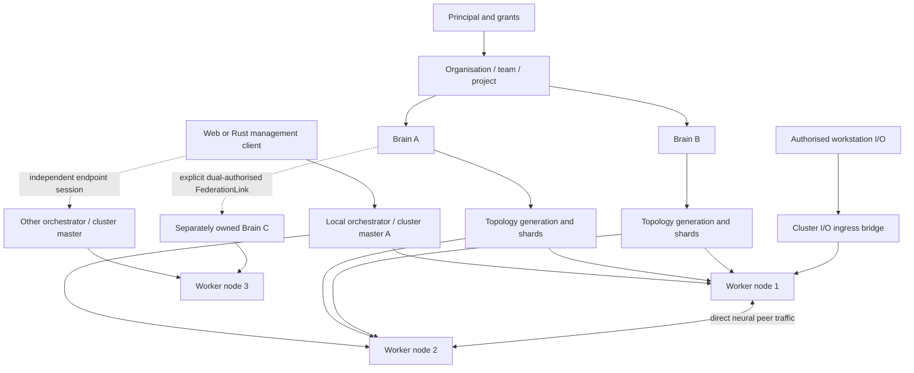

# Distributed orchestration and brain hierarchy

This guide describes the recommended AARNN topology and the capabilities the
current compatibility runtime can demonstrate. The normative contracts remain
in `docs/specifications/distributed-whole-brain-emulator-v1.1.md` and
[ADR-0006](decisions/ADR-0006-cluster-brain-node-hierarchy.md).

## Keep control, ownership and placement as separate hierarchies

The control hierarchy answers who may manage a cluster. The brain hierarchy
answers which neural state belongs together. The placement hierarchy answers
which workers execute each brain's current work. They meet at an orchestrator,
but they are not interchangeable trees.

Each brain has one identity and independent execution state. Its active shards
may span worker nodes. A worker is a capacity and placement target; its `NodeId`
must never be used as a `BrainId` merely to make it visible in the dashboard.
An orchestrator is the authority and membership scope for its local cluster.
In a workstation/local deployment with no upstream orchestration service, that
same orchestrator is the local cluster master and the local I/O ingress. The
I/O route admits samples under one selected brain's mapping and sends neural
events to the designated sensory owner; subsequent worker-to-worker neural
traffic stays on the direct peer data path.

The UI may keep separate sessions to several orchestrators. That is useful for
operators managing multiple clusters, but does not make one orchestrator the
parent of another, merge their node pools, or create a shared authority. A
future global hierarchy needs a versioned and authorised control-plane
contract with delegation, tenant-scoped resources, audit, quorum, fencing and
failure behaviour.

## Recommended resource and permission model

Use organisation → team → project for ownership and policy; brain → topology
generation → shard/replica for neural state; and cluster master → worker nodes
for physical capacity. Each list, operation and stream is filtered by the
authenticated principal and its grants. Discovery, node registration, UI
visibility and a shared local login do not grant brain access or peripheral
I/O permission.

Brains owned by one principal can share a cluster's permitted compute pool,
subject to tenant and brain weights, minimum shares, quotas and isolation.
Same-owner status alone does not connect their events. To cooperate, configure
an explicit link with schema mapping, time-domain mapping, positive delay,
backpressure and failure policy.

For different owners, each owner must authorise the requested direction and
scope. The link is audited and revocable at a safe boundary. The source and
target brains keep independent clocks, checkpoints, logs, ownership and
permissions. Neither an ID guess nor a `federation_group` string is authority.

The older `related_network_ids`, `combined_group` and `federation_group`
configuration fields influence compatibility placement choices only. They
cannot create causal communication, grant access or stand in for a
`FederationLink`. The reference federation contract is not evidence that the
live distributed data path and production dual-owner policy are enabled.

## Scaling model

Scale one cluster by enrolling more authenticated worker nodes, then place each
brain's virtual shards according to causal locality, effective capacity,
memory, accelerator suitability and failure-domain policy. Keep causal peer
traffic direct; keep management/status separate from high-rate media. No
worker's process count or network reachability proves that a brain has active
shards there: inspect the brain's placement entries and distinguish active
owners from warm copies.

Scale across sites by operating independent orchestration cells. The current
multi-orchestrator UI can observe/manage configured endpoints independently.
Do not treat several singleton orchestrators as a quorum or as one scalable
parent. Production multi-master control awaits the Phase 5–7 safety gates;
cross-cell neural interaction awaits the Phase 8 federation data path.

## Local demonstration and verification

`./run_examples.sh` demonstrates one local cluster cell: `cluster_master` is
the target brain and local cluster-master ID; `node_1` and `node_2` are stable
worker node IDs. The launcher chooses an isolated high orchestrator port by
default so workers left retrying the conventional port cannot join by accident.
Its readiness check confirms the workers appear as members of the cluster and
not as additional network IDs. `scripts/run_cluster.sh
--nodes N`, `run_webcluster.sh` and `run_container_cluster.sh` use the same
identity separation for local host/container runs. `scripts/deploy_mixed_cluster.sh`
is a single local orchestrator plus registered Kubernetes worker pool, not a
multi-orchestrator federation demonstration.

The local launcher uses development credentials for its loopback test profile.
Its output verifies process and cluster-status behaviour only; it does not
verify consensus-backed failover, OIDC/PKCE, production node enrolment,
cross-tenant grants, live multi-owner federation or production shard ownership.
`scripts/qa/run-discovery.sh` and `scripts/qa/run-federation.sh` exercise their
catalogued reference contracts and must be labelled accordingly.
